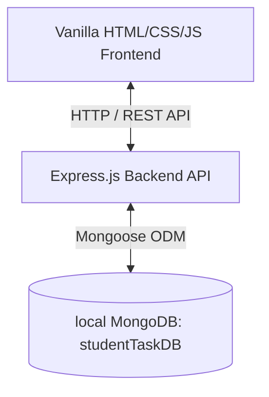

# Student Task Management System Overview

This project is a full-stack, single-page application (SPA) designed to manage tasks for students. It comprises a Node.js/Express backend that interfaces with a local MongoDB database, and a client-side frontend built with standard vanilla web technologies (HTML, CSS, JS).

---

## 🏛 Architecture & Tech Stack



### 1. Backend (Server-Side)
- **Runtime**: Node.js
- **Web Framework**: Express.js
- **Database**: MongoDB (via Mongoose ODM)
- **Key Modules**:
  - `cors`: Enables Cross-Origin Resource Sharing.
  - `dotenv`: Manages environment variables via `.env`.
  - `nodemon`: Automatically restarts the backend server during development.

### 2. Frontend (Client-Side)
- **Frameworks**: None (Pure vanilla HTML5, CSS3, and JavaScript).
- **Icons**: Font Awesome (v6.7.2).
- **Fonts**: Poppins.

---

## 📂 Codebase File Structure

Here is a breakdown of the key files in the repository:

```text
student-task-management-system/
├── client/                     # Frontend client files
│   ├── css/
│   │   ├── darkmode.css        # Styles for the Dark Theme toggle
│   │   ├── responsive.css      # CSS media queries for tablets & mobile
│   │   ├── style.css           # Global layout, tables, forms, and main styles
│   │   └── variables.css       # Core design system tokens (colors, fonts, etc.)
│   ├── js/
│   │   ├── api.js              # Fetch client wrapper for backend task endpoints
│   │   ├── app.js              # Coordinator managing forms, table rows, and state
│   │   ├── darkmode.js         # Dark mode toggle state logic (with local storage)
│   │   ├── dashboard.js        # Aggregates and renders task statistics counters
│   │   ├── filter.js           # Event listeners for task category filters
│   │   ├── navigation.js       # Handles smooth scrolling & nav active states
│   │   ├── responsive.js       # Sidebar toggle controls for smaller viewports
│   │   ├── search.js           # Search inputs handler
│   │   ├── shortcuts.js        # Global shortcuts (e.g. Esc to exit modal, 'N' for new task)
│   │   ├── sort.js             # Sorting options hook (newest, oldest, due date)
│   │   ├── toast.js            # User alerts toast alerts generator
│   │   └── validation.js       # Client-side input validation helper
│   └── index.html              # Main dashboard entrypoint SPA page
├── server/                     # Backend API files
│   ├── config/
│   │   └── db.js               # MongoDB connection initializer
│   ├── controllers/
│   │   └── taskController.js   # Controllers executing Task DB actions (CRUD)
│   ├── middleware/
│   │   ├── errorHandler.js     # Standard system-wide error responses
│   │   ├── logger.js           # HTTP request logging middleware
│   │   ├── notFound.js         # Endpoint fallback 404 handler
│   │   └── validateTask.js     # Schema constraints verification
│   ├── models/
│   │   └── Task.js             # Mongoose model schema for Tasks
│   ├── routes/
│   │   └── taskRoutes.js       # Express route routing configurations
│   ├── utils/                  # Helper utilities
│   ├── app.js                  # App middleware pipeline & entry configs
│   └── server.js               # Entrypoint script starts Server and DB connection
├── .env                        # Local configurations containing port and Mongo URI
├── package.json                # Project dependencies and script runner configurations
└── README.md                   # Project instructions document (currently blank)
```

---

## ⚡ API Endpoint Routing

All task endpoints are prefixed with `/api/tasks` and map to the controller functions in [taskController.js](file:///c:/Users/Person/Desktop/student-task-management-system/server/controllers/taskController.js):

| Method | Endpoint | Description | Middleware |
| :--- | :--- | :--- | :--- |
| **GET** | `/api/tasks` | Retrieves all tasks sorted by creation date (newest first). | *None* |
| **GET** | `/api/tasks/:id` | Fetches a single task by its unique ID. | *None* |
| **POST** | `/api/tasks` | Creates a new task. | [validateTask](file:///c:/Users/Person/Desktop/student-task-management-system/server/middleware/validateTask.js) |
| **PUT** | `/api/tasks/:id` | Updates an existing task by its unique ID. | [validateTask](file:///c:/Users/Person/Desktop/student-task-management-system/server/middleware/validateTask.js) |
| **DELETE**| `/api/tasks/:id` | Deletes a task by ID. | *None* |

---

## 💾 Database Schema: `Task`

Defined in [Task.js](file:///c:/Users/Person/Desktop/student-task-management-system/server/models/Task.js), the fields are:
- `title` (String, required, length: 3-100 characters, whitespace-trimmed)
- `description` (String, max length: 500 characters, defaults to `""`)
- `priority` (Enum: `"Low"`, `"Medium"`, `"High"`, defaults to `"Medium"`)
- `status` (Enum: `"Pending"`, `"InProgress"`, `"Completed"`, defaults to `"Pending"`)
- `dueDate` (Date, required)
- `timestamps` (Mongoose automatically injects `createdAt` and `updatedAt`)
- *Index*: Built-in text index on `title` to allow text search lookup queries.

---

## 🛡️ Validation Rules

Validation occurs on **both** the client side ([validation.js](file:///c:/Users/Person/Desktop/student-task-management-system/client/js/validation.js)) and the backend middleware ([validateTask.js](file:///c:/Users/Person/Desktop/student-task-management-system/server/middleware/validateTask.js)):

1. **Title**: Required. Minimum 3 characters. Maximum 100 characters.
2. **Priority**: Required. Must be exactly one of: `Low`, `Medium`, or `High`.
3. **Status**: Optional (defaults to `Pending`). Must be one of: `Pending`, `InProgress`, or `Completed`.
4. **Due Date**: Required. Must be a valid date format, and cannot be in the past.
